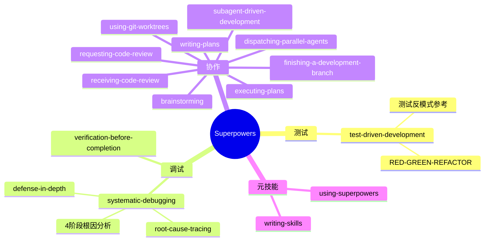

<div align="center">

# 🦸 Superpowers 中文版

### 让你的 AI 编程 Agent 不再是无脑写码机器

[](https://github.com/obra/superpowers)
[](LICENSE)
[](.)
[](https://cursor.sh)
[](https://claude.ai)

<br/>

> **你说"加个功能"，AI 二话不说狂写 500 行——方向完全跑偏？**
>
> Superpowers 给 AI 装了一套**强制工作流**：先问、再想、后写、最后自查。

<br/>

</div>

---

## 🔥 一句话理解

```
没装 Superpowers 的 AI：    "收到！马上写！"  →  500 行垃圾代码  →  "重来？"
装了 Superpowers 的 AI：    "等等，先聊聊你要什么"  →  方案对比  →  TDD  →  自动 Review  →  ✅
```

---

## 🔄 工作流全景


<table>
<tr>
<td width="14%" align="center">

**1️⃣ 头脑风暴**<br/><sub>先问清楚你要什么<br/>一次一个问题</sub>

</td>
<td width="14%" align="center">

**2️⃣ 分支隔离**<br/><sub>Git worktree<br/>不污染主分支</sub>

</td>
<td width="14%" align="center">

**3️⃣ 写计划**<br/><sub>拆成2~5分钟小任务<br/>含文件路径+验证步骤</sub>

</td>
<td width="14%" align="center">

**4️⃣ 子Agent开发**<br/><sub>每个任务派一个Agent<br/>互不干扰</sub>

</td>
<td width="14%" align="center">

**5️⃣ TDD**<br/><sub>先写失败测试<br/>再写最小实现</sub>

</td>
<td width="14%" align="center">

**6️⃣ 双轮Review**<br/><sub>规格合规 ✓<br/>代码质量 ✓</sub>

</td>
<td width="14%" align="center">

**7️⃣ 收尾**<br/><sub>跑测试 → merge<br/>清理工作区</sub>

</td>
</tr>
</table>

---

## ⚡ 30 秒安装

<table>
<tr>
<td width="33%">

### 🖱️ Cursor

```
/add-plugin superpowers
```

</td>
<td width="33%">

### 🤖 Claude Code

```bash
/plugin install superpowers@claude-plugins-official
```

</td>
<td width="33%">

### 🧬 Gemini CLI

```bash
gemini extensions install \
  https://github.com/obra/superpowers
```

</td>
</tr>
<tr>
<td>

### 📦 Codex

```
Fetch and follow instructions from
https://raw.githubusercontent.com/
obra/superpowers/refs/heads/main/
.codex/INSTALL.md
```

</td>
<td>

### 🇨🇳 Trae / 国产IDE

```bash
git clone https://github.com/\
HenryZ838978/superpowers-cn.git

# 将 skills/ 目录放入
# IDE 的插件/规则目录
```

</td>
<td>

### ✅ 验证

开个新会话，说：

> "帮我规划一个功能"

如果 AI **先问你问题**<br/>而不是直接写代码<br/>→ 安装成功 🎉

</td>
</tr>
</table>

---

## 🧰 技能一览



<table>
<tr><th>类别</th><th>技能</th><th>干什么的</th></tr>
<tr><td rowspan="1">🧪 测试</td><td><code>test-driven-development</code></td><td>RED → GREEN → REFACTOR 循环，含反模式速查</td></tr>
<tr><td rowspan="2">🔧 调试</td><td><code>systematic-debugging</code></td><td>4 阶段根因定位（含 tracing / defense-in-depth / 条件等待）</td></tr>
<tr><td><code>verification-before-completion</code></td><td>确保真的修好了，不是"我觉得好了"</td></tr>
<tr><td rowspan="9">🤝 协作</td><td><code>brainstorming</code></td><td>苏格拉底式追问，把模糊想法变清晰设计</td></tr>
<tr><td><code>writing-plans</code></td><td>把设计拆成 2~5 分钟可执行任务</td></tr>
<tr><td><code>executing-plans</code></td><td>分批执行 + 人工检查点</td></tr>
<tr><td><code>dispatching-parallel-agents</code></td><td>并发子 Agent 工作流</td></tr>
<tr><td><code>subagent-driven-development</code></td><td>子 Agent 快速迭代 + 两轮 Review</td></tr>
<tr><td><code>requesting-code-review</code></td><td>审查前置清单</td></tr>
<tr><td><code>receiving-code-review</code></td><td>响应审查反馈</td></tr>
<tr><td><code>using-git-worktrees</code></td><td>并行开发分支隔离</td></tr>
<tr><td><code>finishing-a-development-branch</code></td><td>Merge / PR / 保留 / 丢弃 决策流</td></tr>
<tr><td rowspan="2">🧬 元技能</td><td><code>writing-skills</code></td><td>按最佳实践写新技能</td></tr>
<tr><td><code>using-superpowers</code></td><td>技能系统入门</td></tr>
</table>

---

## 🆚 中文版改了什么

<table>
<tr><th></th><th>🇺🇸 原版</th><th>🇨🇳 豆角中文版</th></tr>
<tr><td>💬 Skill Prompts</td><td>全英文</td><td><b>全中文翻译</b>（技术术语保留英文）</td></tr>
<tr><td>📖 README</td><td>英文</td><td><b>中文</b></td></tr>
<tr><td>🛠️ 安装指南</td><td>面向 Claude Code</td><td><b>适配 Cursor / Trae / Claude Code</b></td></tr>
<tr><td>📝 代码</td><td>不动</td><td>不动（MIT 协议）</td></tr>
</table>

> 📌 代码版权归原作者 [Jesse Vincent](https://github.com/obra)。用得爽去给上游点 Star → [obra/superpowers](https://github.com/obra/superpowers)

---

## 🧭 设计哲学

<table>
<tr>
<td align="center" width="25%">

### 🧪
**测试驱动**<br/><sub>永远先写测试</sub>

</td>
<td align="center" width="25%">

### 📐
**系统化**<br/><sub>流程优于猜测</sub>

</td>
<td align="center" width="25%">

### 🎯
**降低复杂度**<br/><sub>简单是首要目标</sub>

</td>
<td align="center" width="25%">

### 🔬
**证据为王**<br/><sub>验证通过才算成功</sub>

</td>
</tr>
</table>

---

## 🤝 贡献

1. Fork 本仓库
2. 创建分支
3. 按 `skills/writing-skills/SKILL.md` 规范写新技能
4. 提交 PR

---

<div align="center">

**MIT License** · 原版由 [Jesse Vincent](https://blog.fsck.com) & [Prime Radiant](https://primeradiant.com) 构建 · 中文版由 **豆角** 维护

用得爽？给上游点 Star ⭐ → [obra/superpowers](https://github.com/obra/superpowers)

</div>
