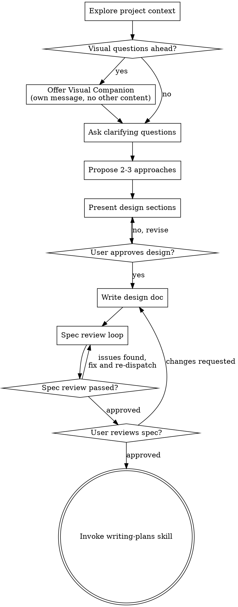

# 将想法头脑风暴为设计

通过自然的协作式对话，帮助把想法变成完整的设计与规格。

先理解当前项目上下文，然后每次只问一个问题来细化想法。一旦清楚要构建什么，就呈现设计并请用户批准。

<HARD-GATE>
在呈现设计且用户批准之前，不得调用任何实现类 skill、不得写任何代码、不得搭建项目骨架、不得采取任何实现动作。无论项目看起来多简单，一律适用。
</HARD-GATE>

## 反模式：「这太简单了，不需要设计」

每个项目都要走这一流程。待办列表、单函数小工具、改配置——全部如此。「简单」项目往往是未检验假设导致最多返工的地方。设计可以很短（真正简单的项目几句话即可），但必须呈现并获批准。

## 检查清单

你必须为下列每一项创建任务并按顺序完成：

1. **探索项目上下文** — 查看文件、文档、近期 commit
2. **提供可视化辅助**（若话题会涉及视觉问题）— 单独一条消息，不与澄清问题合并。见下文「可视化辅助」一节。
3. **提出澄清问题** — 一次一个，弄清目的/约束/成功标准
4. **提出 2–3 种方案** — 含取舍与你的推荐
5. **呈现设计** — 按复杂度分节，每节后请用户确认是否 OK
6. **撰写设计文档** — 保存到 `docs/superpowers/specs/YYYY-MM-DD-<topic>-design.md` 并 commit
7. **规格评审循环** — 派发 spec-document-reviewer subagent，并附上精心编写的评审上下文（不要用本会话历史）；修复问题并再次派发，直至通过（最多 3 轮，之后交给真人）
8. **用户审阅成文规格** — 继续前请用户阅读规格文件
9. **转入实现** — 调用 writing-plans skill 生成实现计划

## 流程概览

**终止状态是调用 writing-plans。** 不要调用 frontend-design、mcp-builder 或其他实现类 skill。头脑风暴之后唯一应调用的 skill 是 writing-plans。

## 流程说明

**理解想法：**

- 先了解当前项目状态（文件、文档、近期 commit）
- 在问细节前评估范围：若请求描述多个彼此独立的子系统（例如「做一个带聊天、文件存储、计费和分析的平台」），立即标出。不要在一个需要先拆分的项目上花大量问题抠细节。
- 若项目过大、无法单份规格承载，帮助用户拆成子项目：有哪些独立部分、如何关联、应按什么顺序构建？然后对第一个子项目按常规设计流程做头脑风暴。每个子项目各自走 spec → plan → 实现循环。
- 对范围合适的项目，一次一个问题细化想法
- 尽量用选择题，开放式也可以
- 每条消息只问一个问题——若某话题需要多轮，拆成多个问题
- 重点弄清：目的、约束、成功标准

**探索方案：**

- 提出 2–3 种不同方案及取舍
- 用对话方式呈现选项，附上你的推荐与理由
- 先给出推荐选项并解释原因

**呈现设计：**

- 一旦认为已理解要构建的内容，呈现设计
- 各节篇幅按复杂度伸缩：直白的几句话即可，复杂的可到约 200–300 词
- 每节后询问目前方向是否正确
- 覆盖：架构、组件、数据流、错误处理、测试
- 若有不通之处，准备好回头澄清

**为隔离与清晰而设计：**

- 把系统拆成更小单元，各单元单一明确职责，经清晰接口通信，可独立理解与测试
- 对每个单元应能回答：做什么、怎么用、依赖什么？
- 不读内部能否理解单元行为？改内部能否不破坏调用方？若不能，边界需再打磨。
- 更小、边界清晰的单元也更利于你工作——你能更好推理单次可装入上下文的代码，文件职责集中时编辑更可靠。文件变大往往是「做得太多」的信号。

**在现有代码库中工作：**

- 提出改动前先摸清当前结构，遵循既有模式。
- 若现有代码存在影响本工作的具体问题（如文件过大、边界不清、职责纠缠），把有针对性的改进纳入设计——就像优秀开发者会顺手改进正在动到的代码。
- 不要提议无关重构，聚焦当前目标。

## 设计完成之后

**文档：**

- 将经确认的设计（spec）写入 `docs/superpowers/specs/YYYY-MM-DD-<topic>-design.md`
  - （用户对规格路径的偏好优先于本默认）
- 若有 elements-of-style:writing-clearly-and-concisely skill 则使用
- 将设计文档 commit 到 git

**规格评审循环：**
写完规格后：

1. 派发 spec-document-reviewer subagent（见 spec-document-reviewer-prompt.md）
2. 若发现问题：修复、再次派发，重复直至通过
3. 若循环超过 3 轮，交由真人决策

**用户审阅关卡：**
规格评审循环通过后，请用户在继续前阅读成文规格：

> 「规格已写入并 commit 到 `<path>`。请审阅；若希望在开始写实现计划前修改，请告诉我。」

等待用户回复。若要求修改，修改后重新跑规格评审循环。仅在用户认可后再继续。

**实现：**

- 调用 writing-plans skill 生成详细实现计划
- 不要调用其他任何 skill。下一步只能是 writing-plans。

## 核心原则

- **一次一个问题** — 不要用多个问题把人淹没
- **优先选择题** — 在可行时比开放式更容易回答
- **YAGNI 要狠** — 从所有设计中拿掉非必要功能
- **探索替代方案** — 落定前总要提出 2–3 种做法
- **增量确认** — 呈现设计、获批准后再前进
- **保持灵活** — 有不清楚处就回头澄清

## 可视化辅助

基于浏览器的辅助工具，用于在头脑风暴中展示线框图、示意图和视觉选项。作为工具提供，而非一种「模式」。接受辅助只表示在适合视觉化的问题上有此选项；**不表示**每个问题都要走浏览器。

**提供辅助：** 当你预期后续问题会涉及视觉内容（线框、版式、示意图）时，征得同意后可提供一次：
> 「接下来有些内容若在网页里展示可能更好理解。我可以边聊边做 mockup、示意图、对比和其他视觉材料。该功能仍较新，可能消耗较多 token。要试试吗？（需要打开本地 URL）」

**该提议必须单独成条消息。** 不要与澄清问题、上下文摘要或其他内容合并。消息中**只含**上述提议，别无他物。等用户回应后再继续。若拒绝，则仅用文本继续头脑风暴。

**逐题决策：** 即使用户同意，对**每一题**单独判断是否用浏览器或终端。检验标准：**用户是「看到」比「读到」更懂吗？**

- **用浏览器** 针对**视觉性**内容 — mockup、线框、版式对比、架构图、并排视觉设计
- **用终端** 针对**文本性**内容 — 需求问题、概念选择、取舍列表、A/B/C/D 文字选项、范围决策

UI 相关的问题不自动等于视觉问题。「在此语境下 personality 指什么？」是概念题 — 用终端。「哪种向导版式更好？」是视觉题 — 用浏览器。

若用户同意使用辅助，继续前请先阅读详细说明：
`skills/brainstorming/visual-companion.md`
