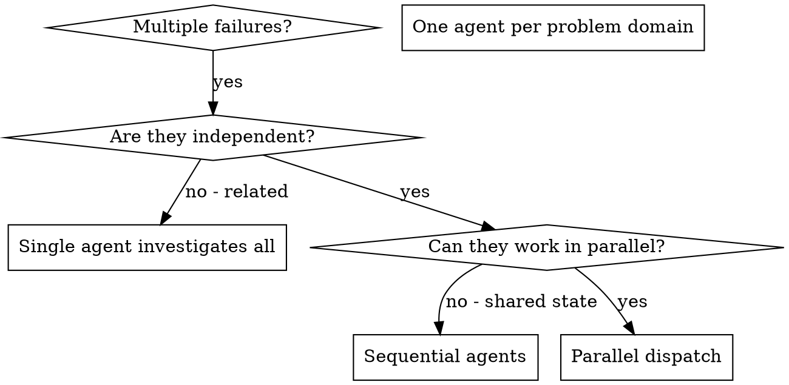

# 并行派发 Agent

## 概述

将任务委派给上下文隔离的专业 agent。通过精确编写其指令与上下文，使其专注并成功完成任务。它们不应继承本会话的上下文或历史——你只构造它们需要的内容。这也为你保留上下文，便于协调。

当存在多个互不相关的失败（不同测试文件、不同子系统、不同 bug）时，串行排查浪费时间。每项调查彼此独立，可以并行进行。

**核心原则：** 每个独立问题域派发一个 agent，让它们并发工作。

## 何时使用



**适用于：**
- 3+ 个测试文件失败且根因不同
- 多个子系统各自独立损坏
- 每个问题无需其他问题的上下文即可理解
- 调查之间无共享状态

**不适用于：**
- 失败彼此相关（修一个可能修好别的）
- 需要理解完整系统状态
- agent 会互相干扰

## 模式

### 1. 识别独立域

按「什么坏了」分组失败：
- 文件 A 的测试：工具审批流
- 文件 B 的测试：批处理完成行为
- 文件 C 的测试：中止功能

各域独立——修工具审批不会影响中止测试。

### 2. 构造聚焦的 Agent 任务

每个 agent 获得：
- **明确范围：** 一个测试文件或子系统
- **清晰目标：** 让这些测试通过
- **约束：** 不要改动其他代码
- **期望输出：** 你发现并修复了什么的摘要

### 3. 并行派发

```typescript
// In Claude Code / AI environment
Task("Fix agent-tool-abort.test.ts failures")
Task("Fix batch-completion-behavior.test.ts failures")
Task("Fix tool-approval-race-conditions.test.ts failures")
// All three run concurrently
```

### 4. 审阅与整合

当 agent 返回时：
- 阅读各摘要
- 确认修复无冲突
- 跑完整测试套件
- 整合所有变更

## Agent 提示结构

好的 agent 提示具备：
1. **聚焦** — 单一清晰问题域
2. **自包含** — 理解问题所需的全部上下文
3. **输出明确** — agent 应返回什么？

```markdown
Fix the 3 failing tests in src/agents/agent-tool-abort.test.ts:

1. "should abort tool with partial output capture" - expects 'interrupted at' in message
2. "should handle mixed completed and aborted tools" - fast tool aborted instead of completed
3. "should properly track pendingToolCount" - expects 3 results but gets 0

These are timing/race condition issues. Your task:

1. Read the test file and understand what each test verifies
2. Identify root cause - timing issues or actual bugs?
3. Fix by:
   - Replacing arbitrary timeouts with event-based waiting
   - Fixing bugs in abort implementation if found
   - Adjusting test expectations if testing changed behavior

Do NOT just increase timeouts - find the real issue.

Return: Summary of what you found and what you fixed.
```

## 常见错误

**❌ 过宽：**「修所有测试」— agent 会迷失  
**✅ 具体：**「修 agent-tool-abort.test.ts」— 范围聚焦

**❌ 无上下文：**「修 race condition」— agent 不知道在哪  
**✅ 有上下文：** 粘贴错误信息与测试名

**❌ 无约束：** agent 可能大重构  
**✅ 有约束：**「不要改生产代码」或「只修测试」

**❌ 输出模糊：**「修好它」— 你不知道改了什么  
**✅ 具体：**「返回根因与变更摘要」

## 何时不要用

**相关失败：** 修一个可能修好别的 — 先一起调查  
**需要完整上下文：** 理解依赖看到整个系统  
**探索式调试：** 还不清楚哪里坏了  
**共享状态：** agent 会互相干扰（改同一文件、争用同一资源）

## 会话中的真实示例

**场景：** 大重构后 3 个文件共 6 个测试失败

**失败：**
- agent-tool-abort.test.ts：3 个失败（时序）
- batch-completion-behavior.test.ts：2 个失败（工具未执行）
- tool-approval-race-conditions.test.ts：1 个失败（执行次数为 0）

**决策：** 独立域 — 中止逻辑、批处理完成、race 条件彼此分离

**派发：**
```
Agent 1 → Fix agent-tool-abort.test.ts
Agent 2 → Fix batch-completion-behavior.test.ts
Agent 3 → Fix tool-approval-race-conditions.test.ts
```

**结果：**
- Agent 1：用基于事件的等待替代 timeout
- Agent 2：修复事件结构 bug（threadId 位置错误）
- Agent 3：增加等待异步工具执行完成

**整合：** 修复彼此独立、无冲突，全套件通过

**节省时间：** 3 个问题并行解决，相对串行

## 主要收益

1. **并行化** — 多项调查同时进行  
2. **聚焦** — 每个 agent 范围窄，要跟踪的上下文更少  
3. **独立** — agent 互不干扰  
4. **速度** — 3 个问题约等于 1 倍时间解决

## 验证

agent 返回后：
1. **阅读各摘要** — 理解改了什么  
2. **检查冲突** — 是否改了同一处代码？  
3. **跑全套件** — 确认修复能协同工作  
4. **抽查** — agent 也可能犯系统性错误

## 实际影响

来自调试会话（2025-10-03）：
- 3 个文件共 6 个失败
- 并行派发 3 个 agent
- 调查均并发完成
- 修复成功整合
- agent 变更之间零冲突
