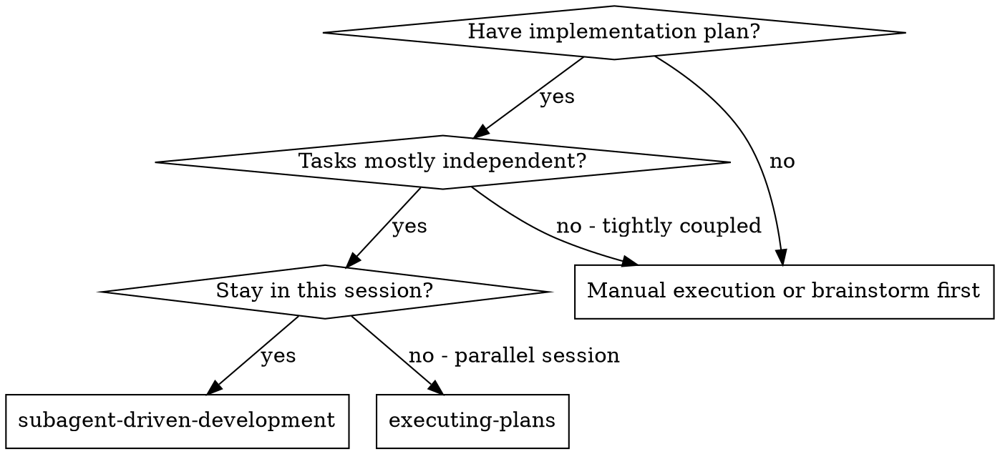
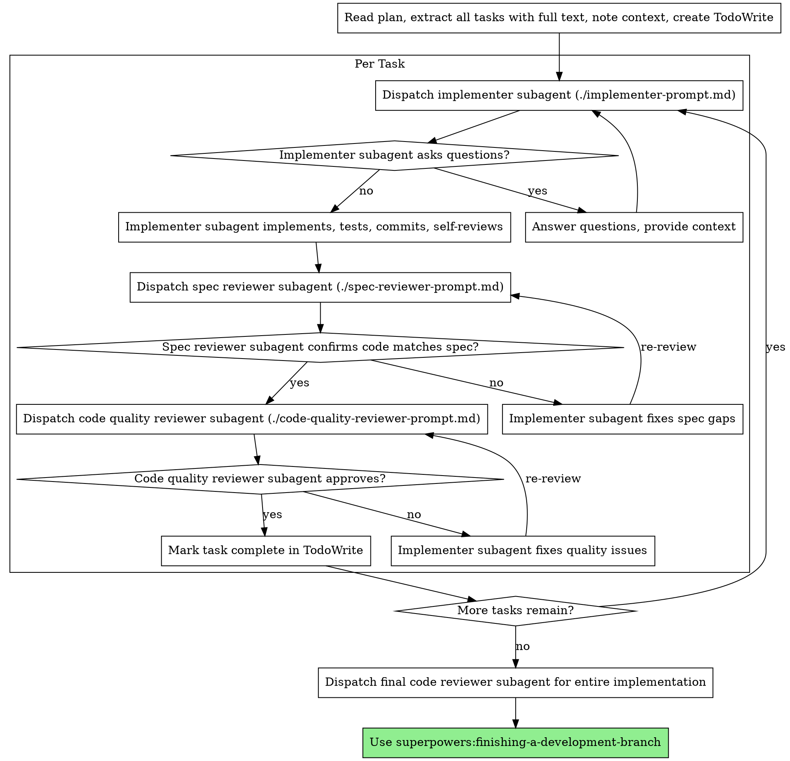

# Subagent-Driven Development

通过为每个任务派发全新的 subagent 来执行计划；每个任务后分两阶段评审：先做 spec 符合性评审，再做代码质量评审。

**为何用 subagent：** 将任务委派给上下文隔离的专业 agent。通过精确编写指令与上下文，使其专注并成功完成任务。它们不应继承本会话的上下文或历史——你只构造它们需要的内容。这也为你保留上下文，便于协调。

**核心原则：** 每任务全新 subagent + 两阶段评审（先 spec 后质量）= 高质量、快迭代

## 何时使用



**与 Executing Plans（并行会话）对比：**
- 同一会话（无需切换上下文）
- 每任务全新 subagent（无上下文污染）
- 每任务后两阶段评审：先 spec 符合性，再代码质量
- 更快迭代（任务之间无需人类介入）

## 流程



## 模型选择

对每个角色使用能胜任的**最弱**模型，以节省成本、提高速度。

**机械实现任务**（孤立函数、规格清晰、1–2 个文件）：用快速、便宜模型。计划写得好时，多数实现任务都是机械性的。

**整合与判断任务**（多文件协调、模式匹配、调试）：用标准模型。

**架构、设计与评审任务**：用当前可用的最强模型。

**任务复杂度信号：**
- 触及 1–2 个文件且 spec 完整 → 便宜模型  
- 多文件且有整合顾虑 → 标准模型  
- 需要设计判断或广泛理解代码库 → 最强模型  

## 处理 Implementer 状态

Implementer subagent 回报四种状态之一，分别处理：

**DONE：** 进入 spec 符合性评审。

**DONE_WITH_CONCERNS：** 已完成但标出疑虑。继续前先读疑虑。若关乎正确性或范围，评审前先处理。若为观察性意见（如「文件变大」），记下并进入评审。

**NEEDS_CONTEXT：** 缺少未提供的信息。补全上下文后再次派发。

**BLOCKED：** 无法完成任务。评估阻塞：
1. 若是上下文问题，提供更多上下文并用同模型再派发  
2. 若任务需要更强推理，换更强模型再派发  
3. 若任务过大，拆成更小片段  
4. 若计划本身有误，上报人类  

**绝不**无视升级或在无变更情况下强迫同模型重试。若 implementer 表示卡住，必须有东西改变。

## 提示模板

- `./implementer-prompt.md` — 派发 implementer subagent  
- `./spec-reviewer-prompt.md` — 派发 spec 符合性评审 subagent  
- `./code-quality-reviewer-prompt.md` — 派发代码质量评审 subagent  

## 示例工作流

```
You: I'm using Subagent-Driven Development to execute this plan.

[Read plan file once: docs/superpowers/plans/feature-plan.md]
[Extract all 5 tasks with full text and context]
[Create TodoWrite with all tasks]

Task 1: Hook installation script

[Get Task 1 text and context (already extracted)]
[Dispatch implementation subagent with full task text + context]

Implementer: "Before I begin - should the hook be installed at user or system level?"

You: "User level (~/.config/superpowers/hooks/)"

Implementer: "Got it. Implementing now..."
[Later] Implementer:
  - Implemented install-hook command
  - Added tests, 5/5 passing
  - Self-review: Found I missed --force flag, added it
  - Committed

[Dispatch spec compliance reviewer]
Spec reviewer: ✅ Spec compliant - all requirements met, nothing extra

[Get git SHAs, dispatch code quality reviewer]
Code reviewer: Strengths: Good test coverage, clean. Issues: None. Approved.

[Mark Task 1 complete]

Task 2: Recovery modes

[Get Task 2 text and context (already extracted)]
[Dispatch implementation subagent with full task text + context]

Implementer: [No questions, proceeds]
Implementer:
  - Added verify/repair modes
  - 8/8 tests passing
  - Self-review: All good
  - Committed

[Dispatch spec compliance reviewer]
Spec reviewer: ❌ Issues:
  - Missing: Progress reporting (spec says "report every 100 items")
  - Extra: Added --json flag (not requested)

[Implementer fixes issues]
Implementer: Removed --json flag, added progress reporting

[Spec reviewer reviews again]
Spec reviewer: ✅ Spec compliant now

[Dispatch code quality reviewer]
Code reviewer: Strengths: Solid. Issues (Important): Magic number (100)

[Implementer fixes]
Implementer: Extracted PROGRESS_INTERVAL constant

[Code reviewer reviews again]
Code reviewer: ✅ Approved

[Mark Task 2 complete]

...

[After all tasks]
[Dispatch final code-reviewer]
Final reviewer: All requirements met, ready to merge

Done!
```

## 优势

**相对手动执行：**
- Subagent 自然遵循 TDD  
- 每任务全新上下文（不易混淆）  
- 可并行安全（subagent 互不干扰）  
- Subagent 可在工作前**与工作中**提问  

**相对 Executing Plans：**
- 同一会话（无交接）  
- 持续进展（无需等待）  
- 评审检查点自动  

**效率：**
- 无反复读文件开销（控制器提供全文）  
- 控制器精确筛选所需上下文  
- Subagent  upfront 获得完整信息  
- 问题在工作开始前暴露（而非之后）  

**质量关卡：**
- 自评在交接前抓问题  
- 两阶段评审：spec 与质量  
- 评审循环确保修复真有效  
- Spec 符合性防止多做/少做  
- 代码质量确保实现本身过硬  

**成本：**
- Subagent 调用更多（每任务 implementer + 2 个评审）  
- 控制器需更多准备（ upfront 抽取所有任务）  
- 评审循环增加轮次  
- 但能尽早发现问题（比事后调试便宜）  

## 危险信号

**绝不：**
- 未经用户明确同意在 main/master 上开始实现  
- 跳过评审（spec 符合性**或**代码质量）  
- 在仍有未修复问题时继续  
- 并行派发多个实现 subagent（会冲突）  
- 让 subagent 读计划文件（应提供全文）  
- 跳过场景设定上下文（subagent 需知任务在整体中的位置）  
- 忽略 subagent 的问题（答完再让其继续）  
- 在 spec 符合性上接受「差不多」（评审发现问题 = 未完成）  
- 跳过评审循环（评审发现问题 = implementer 修 = 再评）  
- 用 implementer 自评替代真实评审（两者都需要）  
- **在 spec 符合性 ✅ 之前开始代码质量评审**（顺序错误）  
- 任一评审仍有未决问题时进入下一任务  

**若 subagent 提问：**
- 清楚、完整回答  
- 必要时补充上下文  
- 不要催着立刻实现  

**若评审发现问题：**
- 由（同一）implementer 修复  
- 评审再次审阅  
- 重复直至通过  
- 不要跳过复评  

**若 subagent 未完成任务：**
- 派发带明确指令的修复 subagent  
- 不要手动去改（会污染上下文）  

## 集成

**所需工作流 skill：**
- **superpowers:using-git-worktrees** — 必选：开始前建立隔离工作区  
- **superpowers:writing-plans** — 生成本 skill 执行的计划  
- **superpowers:requesting-code-review** — 评审 subagent 的 code review 模板  
- **superpowers:finishing-a-development-branch** — 全部任务完成后收尾  

**Subagent 应使用：**
- **superpowers:test-driven-development** — 各任务遵循 TDD  

**替代工作流：**
- **superpowers:executing-plans** — 需要并行会话而非同会话执行时使用  
