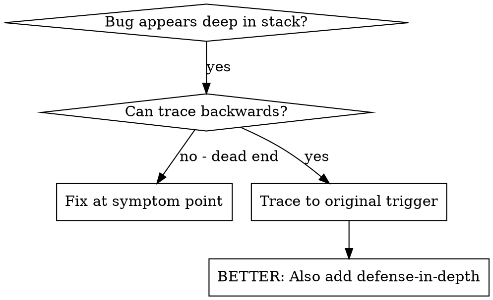
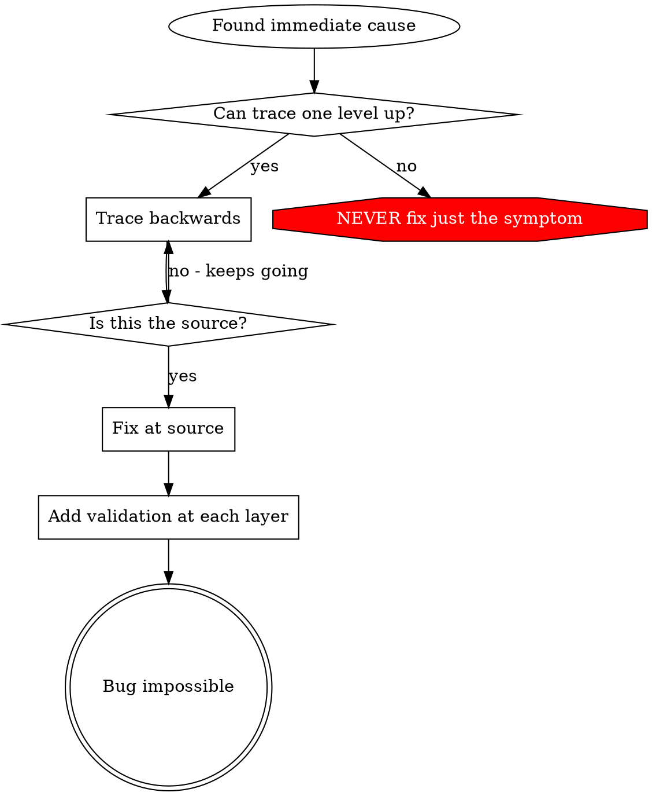

# 根因追溯

## 概述

Bug 常深埋在调用栈里（git init 目录错误、文件建错位置、数据库用错路径）。本能是在报错处修，但那往往只是症状。

**核心原则：** 沿调用链**向上**追到原始触发点，在**源头**修复。

## 何时使用



**适用：**
- 错误发生在执行深处（非入口）
- 栈很深
- 不清楚非法数据从何而来
- 要定位是哪段测试/代码触发

## 追溯流程

### 1. 观察症状
```
Error: git init failed in /Users/jesse/project/packages/core
```

### 2. 找直接原因
**哪段代码直接导致？**
```typescript
await execFileAsync('git', ['init'], { cwd: projectDir });
```

### 3. 问：谁调用了它？
```typescript
WorktreeManager.createSessionWorktree(projectDir, sessionId)
  → called by Session.initializeWorkspace()
  → called by Session.create()
  → called by test at Project.create()
```

### 4. 继续向上
**传入了什么值？**
- `projectDir = ''`（空字符串！）
- 空字符串作 `cwd` 会落到 `process.cwd()`
- 即源码目录！

### 5. 找原始触发
**空字符串从哪来？**
```typescript
const context = setupCoreTest(); // Returns { tempDir: '' }
Project.create('name', context.tempDir); // Accessed before beforeEach!
```

## 加栈追踪

手工跟不动时，加埋点：

```typescript
// Before the problematic operation
async function gitInit(directory: string) {
  const stack = new Error().stack;
  console.error('DEBUG git init:', {
    directory,
    cwd: process.cwd(),
    nodeEnv: process.env.NODE_ENV,
    stack,
  });

  await execFileAsync('git', ['init'], { cwd: directory });
}
```

**关键：** 测试里用 `console.error()`（勿用 logger — 可能被吞）

**运行并捕获：**
```bash
npm test 2>&1 | grep 'DEBUG git init'
```

**分析栈：**
- 找测试文件名
- 找触发行号
- 识别模式（同一测试？同一参数？）

## 定位「污染」来自哪个测试

测试中某副作用出现但不知道哪个测试导致：

使用本目录二分脚本 `find-polluter.sh`：

```bash
./find-polluter.sh '.git' 'src/**/*.test.ts'
```

逐个跑测试，在第一个污染者处停止。用法见脚本内说明。

## 实例：空的 projectDir

**症状：** `packages/core/` 下出现 `.git`（源码目录）

**追溯链：**
1. `git init` 在 `process.cwd()` 执行 ← 空的 cwd 参数
2. WorktreeManager 收到空的 projectDir
3. `Session.create()` 传入空串
4. 测试在 `beforeEach` 之前访问了 `context.tempDir`
5. `setupCoreTest()` 初始返回 `{ tempDir: '' }`

**根因：** 顶层变量在 `beforeEach` 前就读了空值

**修复：** `tempDir` 改为 getter，在 `beforeEach` 前访问则抛错

**同时补 defense-in-depth：**
- Layer 1：`Project.create()` 校验目录
- Layer 2：`WorkspaceManager` 校验非空
- Layer 3：`NODE_ENV` 护栏拒绝 tmpdir 外 git init
- Layer 4：git init 前打 stack trace

## 核心原则



**不要只在报错处贴创可贴。** 回追到原始触发点再修。

## 栈追踪技巧

**测试中：** 用 `console.error()` 不用 logger — logger 可能被关掉  
**在危险操作前：** 在失败前打日志，而非失败后  
**带上下文：** 目录、cwd、环境变量、时间戳  
**捕获栈：** `new Error().stack` 显示完整调用链

## 实际效果

来自排障会话（2025-10-03）：
- 经 5 层追溯找到根因
- 在源头修复（getter 校验）
- 叠加 4 层 defense
- 1847 测试全过，零污染
