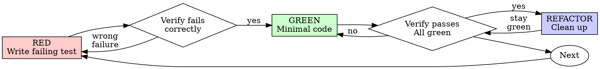

# Test-Driven Development (TDD)

## 概述

先写测试。看它失败。写最少代码让它通过。

**核心原则：** 若你没看到测试失败，就不知道它测的是否正确。

**违反规则的字面规定，就是违反规则的精神。**

## 何时使用

**始终：**
- 新功能  
- Bug 修复  
- 重构  
- 行为变更  

**例外（询问人类伙伴）：**
- 一次性原型  
- 生成代码  
- 配置文件  

心想「就这一次跳过 TDD」？停。那是自我辩解。

## 铁律

```
NO PRODUCTION CODE WITHOUT A FAILING TEST FIRST
```

先写实现再写测试？删掉。重来。

**无例外：**
- 不要留着当「参考」
- 不要边写测试边「改编」它
- 不要去看它
- 删就是删

从测试全新实现。没有商量。

## RED-GREEN-REFACTOR



### RED — 写失败测试

写一个最小测试，展示应有行为。

<Good>
```typescript
test('retries failed operations 3 times', async () => {
  let attempts = 0;
  const operation = () => {
    attempts++;
    if (attempts < 3) throw new Error('fail');
    return 'success';
  };

  const result = await retryOperation(operation);

  expect(result).toBe('success');
  expect(attempts).toBe(3);
});
```
名称清晰、测真实行为、只测一件事
</Good>

<Bad>
```typescript
test('retry works', async () => {
  const mock = jest.fn()
    .mockRejectedValueOnce(new Error())
    .mockRejectedValueOnce(new Error())
    .mockResolvedValueOnce('success');
  await retryOperation(mock);
  expect(mock).toHaveBeenCalledTimes(3);
});
```
名称模糊、测的是 mock 不是真实代码
</Bad>

**要求：**
- 单一行为  
- 名称清晰  
- 真实代码（除非不得已不用 mock）

### Verify RED — 观察失败

**强制。绝不跳过。**

```bash
npm test path/to/test.test.ts
```

确认：
- 测试失败（非报错退出）
- 失败信息符合预期
- 因功能缺失而失败（非笔误）

**测试通过了？** 你在测已有行为。改测试。

**测试报错？** 修错误，重跑到「正确失败」为止。

### GREEN — 最少代码

写能通过测试的最简实现。

<Good>
```typescript
async function retryOperation<T>(fn: () => Promise<T>): Promise<T> {
  for (let i = 0; i < 3; i++) {
    try {
      return await fn();
    } catch (e) {
      if (i === 2) throw e;
    }
  }
  throw new Error('unreachable');
}
```
刚好够通过
</Good>

<Bad>
```typescript
async function retryOperation<T>(
  fn: () => Promise<T>,
  options?: {
    maxRetries?: number;
    backoff?: 'linear' | 'exponential';
    onRetry?: (attempt: number) => void;
  }
): Promise<T> {
  // YAGNI
}
```
过度设计
</Bad>

不要加功能、不要顺手重构别处、不要超出测试「改进」。

### Verify GREEN — 观察通过

**强制。**

```bash
npm test path/to/test.test.ts
```

确认：
- 该测试通过  
- 其他测试仍通过  
- 输出干净（无错误、无警告）  

**测试失败？** 改代码，别改测试（除非测试本身错了）。

**其他测试失败？** 现在修。

### REFACTOR — 整理

仅在 green 之后：
- 去重  
- 改进命名  
- 抽取辅助函数  

保持测试 green。不要加行为。

### 重复

下一项功能用下一个失败测试。

## 好测试

| 品质 | 好 | 差 |
|---------|------|-----|
| **最小** | 一事。「名称里有 and」？拆开。 | `test('validates email and domain and whitespace')` |
| **清晰** | 名称描述行为 | `test('test1')` |
| **表达意图** | 展示期望的 API | 掩盖代码应做什么 |

## 为何顺序重要

**「我写完再补测试验证」**

后写的测试一上来就通过。立即通过证明不了什么：
- 可能测错对象  
- 可能测实现而非行为  
- 可能漏掉你已忘的边界  
- 你从未看到它抓住 bug  

测试先行强迫你看到失败，证明测试真有断言力。

**「我已经手动测过所有边界」**

手动测试随意。你以为都测了，其实：
- 没有测了什么记录  
- 代码一变不能重跑  
- 压力下容易忘 case  
- 「我当时试了下可以」≠ 全面  

自动化测试系统化，每次同样跑法。

**「删掉 X 小时工作是浪费」**

沉没成本谬误。时间已花掉。你现在只能选：
- 删掉按 TDD 重写（再花 X 小时，信心高）  
- 留着后补测试（30 分钟，信心低，易有 bug）  

「浪费」是保留不可信的代码。无真正测试能通过的代码是技术债。

**「TDD 教条，务实就要变通」**

TDD **就是**务实：
- commit 前发现 bug（比上线后调试快）  
- 防回归（测试立即发现破坏）  
- 文档化行为（测试展示用法）  
- 支撑重构（大胆改，测试抓破坏）  

「务实」捷径 = 生产环境调试 = 更慢。

**「后写测试目标一样——重在精神不是仪式」**

不。后写回答「这段代码做什么？」先行回答「这段代码**应该**做什么？」

后写被实现带偏。你测的是你写的，不是需求。你验证记得的边界，不是发现的边界。

先行强迫在实现前发现边界。后写验证你是否记得一切（你并没有）。

后写 30 分钟 ≠ TDD。你有覆盖率，失去「测试真能抓 bug」的证明。

## 常见自我辩解

| 借口 | 现实 |
|--------|---------|
| 「太简单不用测」 | 简单代码也会坏。测只要 30 秒。 |
| 「我稍后测」 | 一上来就通过的测试证明不了什么。 |
| 「后写目标一样」 | 后写 =「做什么？」先行 =「应做什么？」 |
| 「已经手动测过」 | 随意 ≠ 系统化。无记录、不可重跑。 |
| 「删掉 X 小时浪费」 | 沉没成本。留着未验证代码是债。 |
| 「留着参考，测试先行写」 | 你会改编它。那就是后写。删就是删。 |
| 「需要先探索」 | 可以。扔掉探索成果，从 TDD 开始。 |
| 「难测 = 设计不清」 | 听测试的。难测 = 难用。 |
| 「TDD 拖慢我」 | TDD 比调试快。务实 = 先行测试。 |
| 「手动更快」 | 手动证明不了边界。每次改都要重测。 |
| 「老代码没测试」 | 你在改进它。给现有代码补测试。 |

## 危险信号 — 停下重来

- 先写实现再写测试  
- 实现之后才写测试  
- 测试一跑就通过  
- 说不清测试为何失败  
- 测试「以后再补」  
- 「就这一次」自我辩解  
- 「我已经手动测过」  
- 「后写目的相同」  
- 「精神比仪式重要」  
- 「留着参考」或「改编现有代码」  
- 「已经花了 X 小时，删了浪费」  
- 「TDD 教条，我这是务实」  
- 「这次情况特殊因为…」  

**以上任一条都表示：删代码。从 TDD 重来。**

## 示例：Bug 修复

**Bug：** 接受空邮箱

**RED**
```typescript
test('rejects empty email', async () => {
  const result = await submitForm({ email: '' });
  expect(result.error).toBe('Email required');
});
```

**Verify RED**
```bash
$ npm test
FAIL: expected 'Email required', got undefined
```

**GREEN**
```typescript
function submitForm(data: FormData) {
  if (!data.email?.trim()) {
    return { error: 'Email required' };
  }
  // ...
}
```

**Verify GREEN**
```bash
$ npm test
PASS
```

**REFACTOR**
若需多字段校验再抽取。

## 完成前核对

标记完成前：

- [ ] 每个新函数/方法有测试  
- [ ] 实现前见过每个测试失败  
- [ ] 每个测试因预期原因失败（缺功能，非笔误）  
- [ ] 对每个测试写了最少通过代码  
- [ ] 全部测试通过  
- [ ] 输出干净（无错误、无警告）  
- [ ] 测试用真实代码（mock 仅必要时）  
- [ ] 边界与错误有覆盖  

不能全勾？你跳过了 TDD。重来。

## 卡住时

| 问题 | 对策 |
|---------|----------|
| 不知怎么测 | 写期望 API。先写断言。问人类伙伴。 |
| 测试太复杂 | 设计太复杂。简化接口。 |
| 必须全 mock | 耦合太重。用依赖注入。 |
| 测试搭建巨大 | 抽辅助函数。仍复杂则简化设计。 |

## 与调试集成

发现 bug？写失败测试复现。走 TDD 循环。测试既证明修复又防回归。

没有测试不要修 bug。

## 测试反模式

加 mock 或测试工具前，阅读 @testing-anti-patterns.md，避免常见坑：
- 测 mock 行为而非真实行为  
- 给生产类加仅测试用的方法  
- 未理解依赖就 mock  

## 最后规则

```
Production code → test exists and failed first
Otherwise → not TDD
```

未经人类伙伴许可，无例外。
