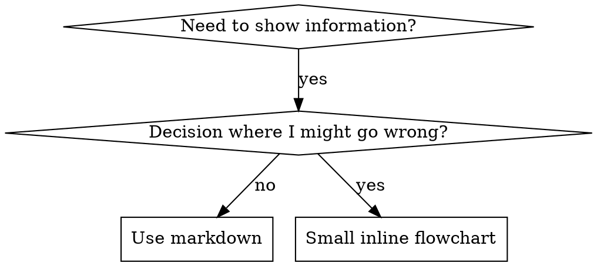

# 撰写 Skill

## 概述

**撰写 skill 就是把 TDD 用在流程文档上。**

**个人 skill 放在各 agent 专用目录**（Claude Code 用 `~/.claude/skills`，Codex 用 `~/.agents/skills/`）

你写测试用例（带 subagent 的压力场景），观察失败（基线行为），写 skill（文档），观察通过（agent 遵守），再重构（堵漏洞）。

**核心原则：** 若你没见过没有 skill 时 agent 如何失败，就不知道 skill 是否教对了。

**必读背景：** 使用本 skill 前**必须**理解 superpowers:test-driven-development。该 skill 定义 fundamental 的 RED-GREEN-REFACTOR 循环。本 skill 把 TDD 适配到文档。

**官方指引：** Anthropic 官方 skill 撰写最佳实践见 anthropic-best-practices.md。该文档提供与本文档 TDD 取向互补的模式与准则。

## 什么是 Skill？

**Skill** 是已验证技术、模式或工具的参考指南。Skill 帮助未来的 Claude 找到并应用有效做法。

**Skill 是：** 可复用技术、模式、工具、参考指南  

**Skill 不是：** 关于你某次如何解决问题的叙事

## 与 TDD 的对应

| TDD 概念 | Skill 创建 |
|-------------|----------------|
| **测试用例** | 带 subagent 的压力场景 |
| **生产代码** | Skill 文档（SKILL.md） |
| **测试失败（RED）** | 无 skill 时 agent 违反规则（基线） |
| **测试通过（GREEN）** | 有 skill 时 agent 遵守 |
| **重构** | 堵漏洞同时保持遵守 |
| **先写测试** | 写 skill **之前**跑基线场景 |
| **观察失败** | 记录 agent 原话自我辩解 |
| **最少代码** | 只写针对这些违规的 skill |
| **观察通过** | 确认 agent 现已遵守 |
| **重构循环** | 发现新借口 → 补上 → 再验证 |

整个 skill 创建过程遵循 RED-GREEN-REFACTOR。

## 何时创建 Skill

**在以下情况创建：**
- 技巧对你并非一目了然  
- 你会在多个项目中再次引用  
- 模式适用范围广（非单一项目）  
- 他人也会受益  

**不要为以下创建：**
- 一次性解法  
- 别处已有充分文档的标准实践  
- 项目专属约定（放进 CLAUDE.md）  
- 机械约束（若能用 regex/校验自动化，就自动化——文档留给需要判断之处）

## Skill 类型

### Technique（技术）
可执行的具体步骤（condition-based-waiting、root-cause-tracing）

### Pattern（模式）
思考问题的方式（flatten-with-flags、test-invariants）

### Reference（参考）
API、语法、工具文档（office docs）

## 目录结构


```
skills/
  skill-name/
    SKILL.md              # Main reference (required)
    supporting-file.*     # Only if needed
```

**扁平命名空间** — 所有 skill 处于同一可搜索空间

**拆成独立文件当：**
1. **厚重参考**（100+ 行）— API、完整语法  
2. **可复用工具** — 脚本、工具、模板  

**保留内联当：**
- 原则与概念  
- 代码模式（< 50 行）  
- 其余内容  

## SKILL.md 结构

**Frontmatter（YAML）：**
- 仅支持两个字段：`name` 和 `description`  
- 合计最多 1024 字符  
- `name`：仅用字母、数字、连字符（无括号等特殊字符）  
- `description`：第三人称，**只**描述何时使用（**不要**写做什么）  
  - 以 "Use when..." 开头，聚焦触发条件  
  - 包含具体症状、情境、上下文  
  - **切勿**概括 skill 的流程或工作流（原因见 CSO 一节）  
  - 可能的话控制在 500 字符内  

```markdown
---
name: Skill-Name-With-Hyphens
description: Use when [specific triggering conditions and symptoms]
---

# Skill Name

## Overview
What is this? Core principle in 1-2 sentences.

## When to Use
[Small inline flowchart IF decision non-obvious]

Bullet list with SYMPTOMS and use cases
When NOT to use

## Core Pattern (for techniques/patterns)
Before/after code comparison

## Quick Reference
Table or bullets for scanning common operations

## Implementation
Inline code for simple patterns
Link to file for heavy reference or reusable tools

## Common Mistakes
What goes wrong + fixes

## Real-World Impact (optional)
Concrete results
```


## Claude Search Optimization（CSO）

**可发现性关键：** 未来的 Claude 需要**找到**你的 skill

### 1. 丰富的 description 字段

**目的：** Claude 读 description 决定是否为当前任务加载 skill。要回答：「我现在该不该读这个 skill？」

**格式：** 以 "Use when..." 开头，聚焦触发条件

**关键：description = 何时用，不是 skill 做什么**

description **只**应描述触发条件。**不要**在 description 里概括 skill 的流程或工作流。

**原因：** 测试表明，若 description 概括工作流，Claude 可能跟着 description 走而不读全文。例如 description 写「任务间 code review」会导致只做**一次** review，尽管正文流程图明确是**两次**（先 spec 符合性再代码质量）。

当 description 改为仅「Use when executing implementation plans with independent tasks in the current session」（无流程摘要）时，Claude 会正确读流程图并遵守两阶段评审。

**陷阱：** 概括工作流的 description 会成为捷径，正文变成 Claude 会跳过的「文档」。

```yaml
# ❌ BAD: Summarizes workflow - Claude may follow this instead of reading skill
description: Use when executing plans - dispatches subagent per task with code review between tasks

# ❌ BAD: Too much process detail
description: Use for TDD - write test first, watch it fail, write minimal code, refactor

# ✅ GOOD: Just triggering conditions, no workflow summary
description: Use when executing implementation plans with independent tasks in the current session

# ✅ GOOD: Triggering conditions only
description: Use when implementing any feature or bugfix, before writing implementation code
```

**内容：**
- 用具体触发、症状、情境表明本 skill 适用  
- 描述*问题*（race conditions、行为不一致），而非*语言专属症状*（setTimeout、sleep），除非 skill 本身技术相关  
- 除非 skill 技术相关，否则触发条件尽量与技术无关  
- 若 skill 技术相关，在触发条件中写清楚  
- 第三人称（注入系统提示）  
- **切勿**概括 skill 的流程或工作流  

```yaml
# ❌ BAD: Too abstract, vague, doesn't include when to use
description: For async testing

# ❌ BAD: First person
description: I can help you with async tests when they're flaky

# ❌ BAD: Mentions technology but skill isn't specific to it
description: Use when tests use setTimeout/sleep and are flaky

# ✅ GOOD: Starts with "Use when", describes problem, no workflow
description: Use when tests have race conditions, timing dependencies, or pass/fail inconsistently

# ✅ GOOD: Technology-specific skill with explicit trigger
description: Use when using React Router and handling authentication redirects
```

### 2. 关键词覆盖

使用 Claude 会搜索的词：
- 错误信息："Hook timed out"、"ENOTEMPTY"、"race condition"  
- 症状："flaky"、"hanging"、"zombie"、"pollution"  
- 同义："timeout/hang/freeze"、"cleanup/teardown/afterEach"  
- 工具：真实命令、库名、文件类型  

### 3. 描述性命名

**主动、动词在前：**
- ✅ `creating-skills` 而非 `skill-creation`  
- ✅ `condition-based-waiting` 而非 `async-test-helpers`  

### 4. Token 效率（关键）

**问题：** getting-started 与高频引用 skill 会加载进**每一次**对话。每个 token 都重要。

**目标字数：**
- getting-started 工作流：每条 <150 词  
- 高频加载 skill：总计 <200 词  
- 其他 skill：<500 词（仍要简洁）  

**技巧：**

**细节移到工具帮助：**
```bash
# ❌ BAD: Document all flags in SKILL.md
search-conversations supports --text, --both, --after DATE, --before DATE, --limit N

# ✅ GOOD: Reference --help
search-conversations supports multiple modes and filters. Run --help for details.
```

**交叉引用：**
```markdown
# ❌ BAD: Repeat workflow details
When searching, dispatch subagent with template...
[20 lines of repeated instructions]

# ✅ GOOD: Reference other skill
Always use subagents (50-100x context savings). REQUIRED: Use [other-skill-name] for workflow.
```

**压缩示例：**
```markdown
# ❌ BAD: Verbose example (42 words)
your human partner: "How did we handle authentication errors in React Router before?"
You: I'll search past conversations for React Router authentication patterns.
[Dispatch subagent with search query: "React Router authentication error handling 401"]

# ✅ GOOD: Minimal example (20 words)
Partner: "How did we handle auth errors in React Router?"
You: Searching...
[Dispatch subagent → synthesis]
```

**消除冗余：**
- 不要重复交叉引用 skill 里已有的内容  
- 不要解释命令本身显而易见之处  
- 不要堆多个相同模式的例子  

**验证：**
```bash
wc -w skills/path/SKILL.md
# getting-started workflows: aim for <150 each
# Other frequently-loaded: aim for <200 total
```

**按「做什么」或核心洞见命名：**
- ✅ `condition-based-waiting` > `async-test-helpers`  
- ✅ `using-skills` 而非 `skill-usage`  
- ✅ `flatten-with-flags` > `data-structure-refactoring`  
- ✅ `root-cause-tracing` > `debugging-techniques`  

**动名词（-ing）适合流程：**
- `creating-skills`、`testing-skills`、`debugging-with-logs`  
- 主动，描述你在做的动作  

### 4. 引用其他 Skill

**文档中引用其他 skill 时：**

仅用 skill 名，并标明是否必选：
- ✅ 好：`**REQUIRED SUB-SKILL:** Use superpowers:test-driven-development`  
- ✅ 好：`**REQUIRED BACKGROUND:** You MUST understand superpowers:systematic-debugging`  
- ❌ 差：`See skills/testing/test-driven-development`（是否必选不清）  
- ❌ 差：`@skills/testing/test-driven-development/SKILL.md`（强制加载，烧上下文）  

**为何不用 @ 链接：** `@` 会立即强制加载文件，在需要前就消耗 200k+ 上下文。

## 流程图用法



**仅在以下情况用流程图：**
- 非显而易见的决策点  
- 可能过早停下的流程循环  
- 「何时用 A 而非 B」  

**永远不要为以下用流程图：**
- 参考材料 → 表格、列表  
- 代码示例 → Markdown 代码块  
- 线性指令 → 编号列表  
- 无语义标签（step1、helper2）  

样式规则见 @graphviz-conventions.dot。

**为人类伙伴可视化：** 用本目录 `render-graphs.js` 将 skill 内流程图渲染为 SVG：
```bash
./render-graphs.js ../some-skill           # Each diagram separately
./render-graphs.js ../some-skill --combine # All diagrams in one SVG
```

## 代码示例

**一个精彩示例胜过多个平庸示例**

选最相关语言：
- 测试技术 → TypeScript/JavaScript  
- 系统调试 → Shell/Python  
- 数据处理 → Python  

**好示例：**
- 完整可运行  
- 注释说明**为何**  
- 来自真实场景  
- 模式清晰  
- 便于改编（非空洞模板）  

**不要：**
- 用 5+ 种语言各写一版  
- 做填空模板  
- 写牵强例子  

你擅长移植——一个绝佳示例足够。

## 文件组织

### 自包含 Skill
```
defense-in-depth/
  SKILL.md    # Everything inline
```
适用：内容都能内联，无厚重参考

### 带可复用工具的 Skill
```
condition-based-waiting/
  SKILL.md    # Overview + patterns
  example.ts  # Working helpers to adapt
```
适用：工具是可复用代码，而非仅叙事

### 带厚重参考的 Skill
```
pptx/
  SKILL.md       # Overview + workflows
  pptxgenjs.md   # 600 lines API reference
  ooxml.md       # 500 lines XML structure
  scripts/       # Executable tools
```
适用：参考材料过大不宜内联

## The Iron Law（与 TDD 相同）

```
NO SKILL WITHOUT A FAILING TEST FIRST
```

适用于**新建** skill **与**对现有 skill 的**编辑**。

先写 skill 再测？删掉。重来。  
改 skill 不测？同样违规。

**无例外：**
- 不是「只是小增补」  
- 不是「只加一节」  
- 不是「文档更新」  
- 不要把未测变更当「参考」留着  
- 不要在跑测试时边测边「改编」  
- 删就是删  

**必读背景：** superpowers:test-driven-development 解释为何重要。原则同样适用于文档。

## 各类 Skill 的测试

不同类型需要不同测法：

### 纪律类 Skill（规则/要求）

**例：** TDD、verification-before-completion、designing-before-coding

**用以下测：**
- 学术问题：是否理解规则？  
- 压力场景：压力下是否遵守？  
- 多重压力组合：时间 + 沉没成本 + 疲惫  
- 识别自我辩解并写明确对策  

**成功标准：** 在最大压力下仍遵守规则  

### 技术类 Skill（操作指南）

**例：** condition-based-waiting、root-cause-tracing、defensive-programming

**用以下测：**
- 应用场景：能否正确应用技术？  
- 变体场景：边界情况如何处理？  
- 信息缺失测试：指令是否有缺口？  

**成功标准：** 能在新场景成功应用技术  

### 模式类 Skill（心智模型）

**例：** reducing-complexity、information-hiding 概念

**用以下测：**
- 识别场景：能否识别模式适用时机？  
- 应用场景：能否使用该心智模型？  
- 反例：是否知道**何时不该**用？  

**成功标准：** 正确判断何时、如何应用模式  

### 参考类 Skill（文档/API）

**例：** API 文档、命令参考、库指南

**用以下测：**
- 检索场景：能否找到正确信息？  
- 应用场景：能否正确使用找到的内容？  
- 缺口测试：常见用例是否覆盖？  

**成功标准：** 找到并正确应用参考信息  

## 跳过测试的常见借口

| 借口 | 现实 |
|--------|---------|
| 「Skill 显然很清楚」 | 对你清楚 ≠ 对其他 agent 清楚。要测。 |
| 「只是参考」 | 参考也会有缺口、含糊章节。要测检索。 |
| 「测试小题大做」 | 未测 skill 几乎总有毛病。测 15 分钟省几小时。 |
| 「有问题再测」 | 问题 = agent 用不了 skill。部署**前**要测。 |
| 「测起来太烦」 | 测比在生产里 debug 坏 skill 更不烦。 |
| 「我有把握」 | 过度自信必有坑。仍要测。 |
| 「通读就够了」 | 读 ≠ 用。要测应用场景。 |
| 「没时间测」 | 部署未测 skill 以后修更费时间。 |

**以上都表示：部署前要测。无例外。**

## 让 Skill 抗自我辩解

像 TDD 这类纪律 skill 要抵抗 rationalization。Agent 很聪明，压力下会找漏洞。

**心理学注：** 理解说服技巧**为何**有效，有助于系统运用。研究基础见 persuasion-principles.md（Cialdini, 2021；Meincke et al., 2025）：权威、承诺、稀缺、社会认同、一体性等原则。

### 显式堵死每条漏洞

不要只陈述规则——要禁止具体绕过方式：

<Bad>
```markdown
Write code before test? Delete it.
```
</Bad>

<Good>
```markdown
Write code before test? Delete it. Start over.

**No exceptions:**
- Don't keep it as "reference"
- Don't "adapt" it while writing tests
- Don't look at it
- Delete means delete
```
</Good>

### 应对「精神 vs 字面」论调

尽早加入基础原则：

```markdown
**Violating the letter of the rules is violating the spirit of the rules.**
```

可切断整类「我遵循精神即可」的借口。

### 建立自我辩解对照表

从基线测试（见下文 Testing）收集借口。agent 说的每个借口都进表：

```markdown
| Excuse | Reality |
|--------|---------|
| "Too simple to test" | Simple code breaks. Test takes 30 seconds. |
| "I'll test after" | Tests passing immediately prove nothing. |
| "Tests after achieve same goals" | Tests-after = "what does this do?" Tests-first = "what should this do?" |
```

### 建立 Red Flags 列表

让 agent 自我检查时容易发现正在 rationalize：

```markdown
## Red Flags - STOP and Start Over

- Code before test
- "I already manually tested it"
- "Tests after achieve the same purpose"
- "It's about spirit not ritual"
- "This is different because..."

**All of these mean: Delete code. Start over with TDD.**
```

### 为 CSO 补充「即将违规」症状

在 description 中加入：何时**快要**违反规则的症状：

```yaml
description: use when implementing any feature or bugfix, before writing implementation code
```

## Skill 的 RED-GREEN-REFACTOR

遵循 TDD 循环：

### RED：写失败测试（基线）

**不带** skill，用 subagent 跑压力场景。记录确切行为：
- 做了哪些选择？  
- 用了哪些自我辩解（原话）？  
- 哪些压力触发了违规？  

这就是「观察测试失败」——写 skill 前必须看到 agent 自然表现。

### GREEN：写最少 Skill

只针对这些具体辩解写 skill。不要为假想情况堆内容。

**带着** skill 跑同样场景。Agent 应现已遵守。

### REFACTOR：堵漏洞

发现新借口？加明确对策。重测直到够硬。

**测试方法：** 完整方法见 @testing-skills-with-subagents.md：
- 如何写压力场景  
- 压力类型（时间、沉没成本、权威、疲惫）  
- 系统化堵洞  
- 元测试技术  

## 反模式

### ❌ 叙事型示例
「在 2025-10-03 会话里我们发现空 projectDir 导致…」  
**为何差：** 过细、不可复用  

### ❌ 多语言稀释
example-js.js、example-py.py、example-go.go  
**为何差：** 质量平庸、维护负担  

### ❌ 流程图里写代码
```dot
step1 [label="import fs"];
step2 [label="read file"];
```
**为何差：** 无法复制粘贴、难读  

### ❌ 泛化标签
helper1、helper2、step3、pattern4  
**为何差：** 标签应有语义  

## 停：进入下一个 Skill 之前

**写完任意 skill 后必须停下，完成部署流程。**

**不要：**
- 未逐个测试就批量创建多个 skill  
- 当前 skill 未验证就进入下一个  
- 因「批量更高效」跳过测试  

**下方部署清单对 EACH skill 都是强制的。**

部署未测 skill = 部署未测代码。违反质量标准。

## Skill 创建清单（TDD 适配）

**重要：用 TodoWrite 为下列每一项建 todo。**

**RED 阶段 — 写失败测试：**
- [ ] 创建压力场景（纪律类至少 3 种压力组合）  
- [ ] **不带** skill 跑场景 — 原样记录基线行为  
- [ ] 归纳自我辩解/失败模式  

**GREEN 阶段 — 写最少 Skill：**
- [ ] 名称仅用字母、数字、连字符（无括号等）  
- [ ] YAML frontmatter 仅 name、description（合计 ≤1024 字符）  
- [ ] Description 以 "Use when..." 开头，含具体触发/症状  
- [ ] Description 第三人称  
- [ ] 全文可搜索关键词（错误、症状、工具）  
- [ ] 清晰 overview 与核心原则  
- [ ] 针对 RED 中识别的具体失败  
- [ ] 代码内联**或**链到单独文件  
- [ ] 一个绝佳示例（不要多语言）  
- [ ] **带着** skill 跑场景 — 确认 agent 遵守  

**REFACTOR 阶段 — 堵漏洞：**
- [ ] 从测试中识别**新**自我辩解  
- [ ] （纪律类）加明确对策  
- [ ] 用所有测试轮次建自我辩解对照表  
- [ ] 建 red flags 列表  
- [ ] 重测直到够硬  

**质量检查：**
- [ ] 仅当决策不显然时用小型流程图  
- [ ] 速查表  
- [ ] Common mistakes 一节  
- [ ] 无叙事故事  
- [ ] 支持文件仅用于工具或厚重参考  

**部署：**
- [ ] 将 skill commit 到 git 并 push 到你的 fork（若已配置）  
- [ ] 若普适性强，可考虑通过 PR 贡献上游  

## 发现工作流

未来 Claude 如何找到你的 skill：

1. **遇到问题**（「tests are flaky」）  
2. **找到 SKILL**（description 匹配）  
4. **扫 overview**（是否相关？）  
5. **读模式**（速查表）  
6. **加载示例**（仅在实现时）  

**为该流程优化** — 尽早、尽量多放可搜索词。

## 底线

**创建 skill 就是流程文档上的 TDD。**

同一铁律：无失败测试则无 skill。  
同一循环：RED（基线）→ GREEN（写 skill）→ REFACTOR（堵洞）。  
同一收益：质量更好、意外更少、结果更硬。

代码用 TDD，skill 也用。是同一条纪律用在文档上。
